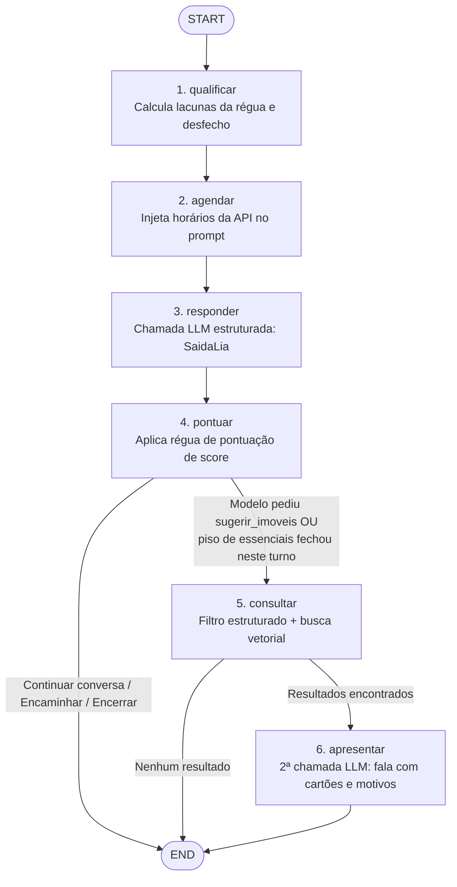

# solar-ai

> **Camada Cognitiva e Agente Conversacional Lia**  
> Para a visão geral do sistema Solar, governança de privacidade de dados, regras de negócio e diagrama de arquitetura completo, consulte o **[README Hub do Solar](https://github.com/fvconde/solar-ai-docs)**.

---

## 1. Papel no Ecossistema

O `solar-ai` é o componente de inteligência artificial do Solar. Implementado em **Python 3.12+** com **FastAPI** e **LangGraph**, ele materializa a corretora virtual **Lia**. Suas responsabilidades centrais são:
- **Diálogo Humanizado e Fluido**: Conduzir conversas naturais focadas em consultoria imobiliária, sem respostas mecânicas ou interrogatórios engessados.
- **Extração Estruturada**: Interpretar a fala do lead e extrair dados semânticos (intenção, faixa orçamentária, quantidade de quartos, bairros de interesse, urgência e expectativa de rentabilidade).
- **Scoring Determinístico por Régua**: Pontuar a maturidade do lead (escala de 0 a 100) através de uma tabela estrita de sinais, identificando com precisão a próxima lacuna a ser explorada.
- **Recomendação Semântica Híbrida (RAG)**: Filtrar o acervo de imóveis combinando restrições estruturadas duras (preço compatível com intenção, quartos mínimos, região) com similaridade vetorial por cosseno sobre as descrições.
- **Arquitetura 100% Stateless**: O agente não possui conexão com banco de dados relacional e não retém estado entre requisições. O histórico da conversa e o perfil acumulado são recebidos integralmente no payload da requisição.

---

## 2. Stack Tecnológica

- **Linguagem**: Python 3.12+
- **Framework Web**: [FastAPI](https://fastapi.tiangolo.com/) com servidor ASGI [Uvicorn](https://www.uvicorn.org/)
- **Orquestração de Agente**: [LangGraph](https://langchain-ai.github.io/langgraph/) (máquina de estados em grafo direcionado)
- **Modelos de Linguagem e Embeddings**: [LangChain Google GenAI](https://python.langchain.com/docs/integrations/chat/google_generative_ai/)
  - Modelo de Geração: `gemini-3.5-flash-lite` (fixado sem alias)
  - Modelo de Embedding: `gemini-embedding-001` (vetor de 768 dimensões)
- **Validação e Tipagem**: [Pydantic v2](https://docs.pydantic.dev/) com gerador de aliases `to_camel` e recusa ativa de campos desconhecidos (`extra="forbid"`)
- **Testes**: Pytest com separação entre testes determinísticos e testes com chamadas ao LLM (`-m llm`)

---

## 3. Grafo Cognitivo da Lia (LangGraph)

O fluxo conversacional da Lia é modelado como um grafo acíclico dirigido (`StateGraph`) de 6 nós em `app/lia/grafo.py`:



### Detalhamento dos Nós:
1. `qualificar`: Função pura que avalia o `perfil_lead` recebido contra a régua determinística, levantando lacunas abertas e determinando desfechos de trilha (`moradia` vs `investimento`).
2. `agendar`: Injeta a lista de horários livres disponíveis (`agenda`) fornecida pela API no prompt do turno.
3. `responder`: Primeira chamada ao Google Gemini com saída estruturada (`SaidaLia`), gerando a fala da Lia, atualizações de perfil, intenção e próxima ação.
4. `pontuar`: Atualiza o score numérico do lead (0 a 100) aplicando a régua de sinais sobre o perfil fundido.
5. `consultar`: Executa a busca no acervo de imóveis quando acionado pelo modelo ou quando o piso de sinais essenciais acabou de ser concluído.
6. `apresentar`: Segunda chamada ao LLM (`SaidaApresentacao`), gerando a mensagem de contextualização dos imóveis selecionados e a justificativa individualizada de cada recomendação.

---

## 4. Contrato Congelado (`POST /turn`)

A comunicação entre a API .NET e o agente Python segue o contrato versionado e congelado definido em `app/contrato.py`, espelhado estritamente com `Contracts/ContratoTurno.cs` da API:
- **Garantia de Integridade**: Ambos os lados recusam expressamente propriedades não mapeadas (`extra="forbid"` no Pydantic e `JsonUnmappedMemberHandling.Disallow` no C#). Mudanças exigem commit coordenado nos dois repositórios.
- **Entrada (`TurnoRequest`)**: `conversa_id`, `mensagem`, `historico` (janela clampada entre 2 e 50 mensagens), `perfil_lead` e `agenda` (slots oferecidos).
- **Saída (`TurnoResponse`)**: `resposta`, `intencao`, `campos_extraidos`, `proxima_acao`, `imoveis_sugeridos` (com dados de renderização completos e motivo textual) e `slot_escolhido`.

---

## 5. Camada de Privacidade e Mascaramento de PII

O agente implementa o módulo `MascaradorPII` (`app/lia/mascaramento.py`), garantindo a preservação da privacidade antes do envio de qualquer dado para a infraestrutura de nuvem externa do Google:

1. **Mascaramento por Regex**: Identifica e substitui CPF pontuado, telefones com DDD, e-mails e CEPs por marcadores sequenciais reversíveis (`[CPF_1]`, `[TELEFONE_1]`, etc.).
2. **Atuação nas Duas Fronteiras com o Google**:
   - **Geração Conversacional**: O método `_invocar` aplica `_mensagens_mascaradas` nos prompts dos nós `responder` e `apresentar`.
   - **Embedding de Busca**: O método `Indice.buscar` mascara o texto da consulta do lead antes de despachá-lo para a API de embeddings do Google.
3. **Des-tokenização Transparente**: O método `_desmascarar_saida` reconstitui os valores originais nas respostas estruturadas devolvidas pelo modelo, permitindo que o lead leia sua própria informação sem expô-la em texto claro ao Google.
4. **Exceções Delimitadas por FUNÇÃO**:
   - `nome` do lead: Vai em claro no `PerfilLead` para viabilizar diálogo humanizado pelo nome.
   - `valores de qualificação e busca`: Faixas de preço, quantidade de quartos e região trafegam em claro porque o modelo precisa raciocinar sobre esses valores para filtrar imóveis.
5. **Contato Fora do LLM**: `telefone` e `email` sequer existem no contrato `POST /turn`, garantindo por desenho arquitetural que dados de contato jamais alcancem os modelos de IA.
6. **Limitações Conhecidas**: Números isolados de 8 dígitos sem rótulo ou 11 dígitos que não componham CPF válido ou telefone com DDD válido passam em claro para prevenir quebras catastróficas de preços e metragens por falsos positivos.

---

## 6. Índice Vetorial em Memória e Cache de Embeddings

- **Acervo de Imóveis**: 80 imóveis simulados carregados do arquivo `data/imoveis.json`.
- **Cálculo de Embeddings**: Cada imóvel é convertido em vetor de 768 dimensões via `gemini-embedding-001` e normalizado para norma unitária.
- **Cache Local por Hash (`data/embeddings.json`)**: Os vetores são gerados previamente e versionados no repositório. Durante o boot, a função `construir` compara o hash sha256 do corpus atual com o do cache; se idêntico, carrega instantaneamente do disco, consumindo **zero requisições de rede e zero cota de embedding** no boot.
- **Degradação Suave**: Caso o índice vetorial não consiga ser inicializado (ex: cota 429 durante geração), a aplicação responde status HTTP 200 com check `indice_imoveis: "degraded"` no `/health`. A Lia segue qualificando e conversando normalmente, suspendendo apenas as recomendações de imóveis.

---

## 7. Como Rodar e Testar

### Configuração do Ambiente Virtual
```bash
python -m venv .venv
# Linux/macOS:
source .venv/bin/activate
# Windows:
.venv\Scripts\Activate.ps1

pip install -r requirements.txt
pip install -r requirements-dev.txt
```

### Variáveis de Ambiente (`.env`)
```env
GEMINI_API_KEY=sua_chave_aqui
GEMINI_MODEL=gemini-3.5-flash-lite
GEMINI_EMBEDDING_MODEL=gemini-embedding-001
GEMINI_TEMPERATURE=0.2
```

### Executar o Servidor Localmente
```bash
uvicorn app.main:app --host 0.0.0.0 --port 8000 --reload
```
Acesse a documentação interativa Swagger em `http://localhost:8000/docs`.

### Executar a Suíte de Testes
Os testes automatizados dividem-se em duas categorias:
1. **Testes Unitários Rápidos (sem consumo de cota do Gemini)**:
   ```bash
   pytest -m "not llm"
   ```
   Valida mascaramento de PII, cálculo de score determinístico, integridade do contrato `/turn`, carregamento do índice e simulação de busca.
2. **Testes de Integração Live com o LLM (consome cota)**:
   ```bash
   pytest -m llm
   ```
   Valida prompts reais, extração semântica com o Gemini e comportamento de apresentação.

### Regenerar Cache de Embeddings
Se o arquivo `data/imoveis.json` for alterado, execute o script utilitário para atualizar o cache versionado:
```bash
python scripts/gerar_embeddings.py
```
